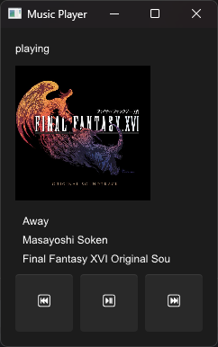

Built with [Slint](https://slint.dev/)

## Next steps

- [ ] Adding a file browser
- [ ] Adding list playback
- [ ] Loading, saving playlists
- [ ] Settings?
- [ ] All the UI
- [ ] Some sort of library (SQLite?)

## Usage

1. Install Rust by following its [getting-started guide](https://www.rust-lang.org/learn/get-started).
   Once this is done, you should have the `rustc` compiler and the `cargo` build system installed in your `PATH`.
2. Git clone the [this repository](https://github.com/slint-ui/slint-rust-template/archive/refs/heads/main.zip).
3. Build with `cargo`:
    ```
    cargo build
    ```
3. Run the application binary:
    ```
    cargo run
    ```